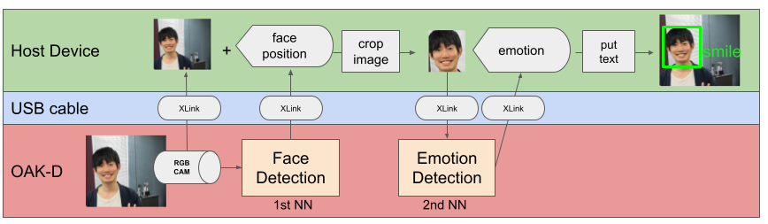

# nobita
A non-verbal communication library for robot development using OAK-D

**Japanese readme is [here](docs/README_JA.md).**

## Preparing
To use this library, you need a Python environment running [OAK-D](https://store.opencv.ai/) and [depthai](https://github.com/luxonis/depthai).

### Install by the repository
```
pip install https://github.com/wbawakate/nobita
```

## Overview
Since Nobita wraps the tedious process of DepthAI, two-step inference such as face detection and emotion estimation can be done with few lines of code. 



This figure shows the data flow when using DepthAI and OAK-D to handle multiple neural networks. First, the first neural network is used to infer the image obtained from the RGB of OAK-D. Then you need to convert the data into the input format of that second neural network. Therefore, it is necessary to transfer data between the OAK-D and the host computer many times. When using depthai without any wrappers, the amount of code to write tends to increase because all data transfer needs to be defined. With Nobita, you can more easily deploy multiple neural networks to OAK-D.

There are two main elements to Nobita; `nobita.modules` and `nobita.VisionPipeline`. `nobita.modules` is a set of neural network modules that handle typical tasks related to non-verbal communication, such as face detection and emotion inference. For more information, see [Modules](##Modules). `nobita.VisionPipeline` deploys `nobita.modules` as a pipeline to OAK-D and performs continuous inference.  

Now, let's start emotion estimation from face images using nobita. The following is the code for face detection and emotion estimation.
```
import cv2
import numpy as np
from nobita import VisionPipeline
from nobita.modules import FaceDetection, EmotionEstimation

emotions = ["neutral", "happy", "sad", "surprise", "anger"]
# prepare VisionPipeline of nobita
#    pass `nobita.modules` to modules as a list
#    if you use OAK-D, set `use_oak=True`
with VisionPipeline(modules=[FaceDetection(), EmotionEstimation()], use_oak=True) as pipeline:
    while True:
        # get result of estimation and camera preview as dict
        #     key of the dict is name of `nobita.modules`.
        #     value of the dict is list of numpy.array, which is prediction values of estimation of the `nobita.module`.
        out_frame = pipeline.get()
        if out_frame["FaceDetection"] :
            # facial image by cropped by face detection 
            face_cv2_frame = cv2.UMat(out_frame["FaceDetection"][0] ) 
            if out_frame["EmotionEstimation"]:
                    id_emo = np.argmax(out_frame["EmotionEstimation"][0])
                    max_prob = np.max(out_frame["FaceDetection"][0])
                    # put estimated emotion on a facial image as text
                    cv2.putText(face_cv2_frame, f"{emotions[id_emo]}",(5, 15),cv2.FONT_HERSHEY_TRIPLEX,0.6,(255,0,0))
            # show the facial image
            cv2.imshow(f"face 0", face_cv2_frame)
        if cv2.waitKey(1) == ord("q"):
            cv2.destroyAllWindows()
            break
```
Just pass `nobita.modules` such as `FaceDetection` and `EmotionEstimation` to `nobita.VisionPipeline` to perform two-step inference easily. The result of the inference can be retrieved as a dictionary with `pipeline.get()`. In the demo, the emotion text inferred by `EmotionEstimation` is pasted on the face image detected by `FaceDetection` and shown on the display.

## Demo
There is demo code for each module in `demo/`.
Run the code as follows in the `demo/` directory.
```
python face_emotion.py
```
Each demo has an option `--device`. This option allows you to specify the device to capture the video. If you are using OAK-D, specify -1 (default). When using other webcams, specify the same device ID as when specifying the device in OpenCV.

## Module
| module | discription | source | blob file | 
|-------|-------------|--------|----|
|FaceDetection | face detection |[OpenVINO Toolkit](https://docs.openvinotoolkit.org/2020.1/_models_intel_face_detection_retail_0004_description_face_detection_retail_0004.html)  |face-detection-retail-0004_openvino_2021.2_6shave.blob |
|PoseEstimation | human pose estimation| [depthai_movenet](https://github.com/geaxgx/depthai_movenet)|movenet_singlepose_lightning_U8_transpose.blob|
|EmotionEstimation | emotion estimation by facial imases |[OpenVINO Toolkit](https://docs.openvinotoolkit.org/2019_R1/_emotions_recognition_retail_0003_description_emotions_recognition_retail_0003.html)| emotions-recognition-retail-0003.blob|
|AgeGender | age and gender estimation facial imases|[OpenVINO Toolkit](https://docs.openvinotoolkit.org/2019_R1/_age_gender_recognition_retail_0013_description_age_gender_recognition_retail_0013.html) | age-gender-recognition-retail-0013_openvino_2021.2_6shave.blob|
|FaceLandmark | facial landmark detection by facial images |[OpenVINO Toolkit](https://docs.openvinotoolkit.org/2019_R1/_facial_landmarks_35_adas_0002_description_facial_landmarks_35_adas_0002.html) | facial-landmarks-35-adas-0002-shaves6.blob|
|HeadPose | head pose estimation by facial images | [OpenVINE](https://docs.openvinotoolkit.org/2019_R1/_head_pose_estimation_adas_0001_description_head_pose_estimation_adas_0001.html)| head-pose-estimation-adas-0001-shaves4.blob |


# Credit
- WBA Future Leaders ( https://wbawakate.jp )
